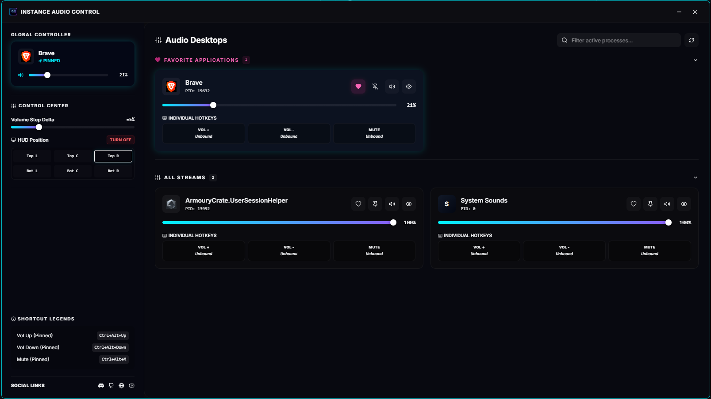

# Instance Audio Control

<p align="center">
  
</p>

<p align="center">
  <strong>An elegant, industrial-themed desktop volume controller built with Rust, Tauri v2, and React.</strong>
</p>

---

Instance Audio Control is a lightweight, zero-latency utility for Windows that gives you complete control over your active application audio sessions. Featuring a sleek, professional UI, fully customizable individual application keybinds, and a non-intrusive interactive HUD overlay.

## 📸 Previews

### Main Dashboard


### Compact Volume HUD Overlay


## ⚡ Key Features

- **Collapsible Application Grids**: Segment your active audio streams into **Favorite Applications**, **All Streams**, and **Hidden Sessions** with dynamic count badges and chevron indicators.
- **Global Controller & Keycap Hotkeys**: Pin any application to bind main keyboard shortcuts, or configure individual app hotkeys (Volume Up, Volume Down, Mute) using flat mechanical-style keycap interfaces.
- **Dynamic overlay HUD**: A non-intrusive click-through HUD that displays volume changes in real-time. Supports customizable positions (Top-Left, Top-Center, Top-Right, Bottom-Left, Bottom-Center, Bottom-Right) and a master toggle switch.
- **Custom step increments**: Adjust your volume step delta dynamically via a control slider from 1% to 20% per keypress.
- **Direct slot unbinding**: Clear hotkeys instantly with a single click using tiny "X" controls directly on card slots.
- **Tray-Only execution**: Minimize to your Windows system tray, showing context options for quick actions (Mute Pinned App, Toggle HUD) and quick left-click restoration.
- **High-DPI support**: Automatic extraction of high-resolution application icons for a clean, sharp look.

## 🛠️ Tech Stack

- **Frontend**: React, TypeScript, Tailwind CSS, Lucide Icons, Framer Motion, Vite
- **Backend**: Rust, Tauri v2, Windows Multimedia Audio (WASAPI), COM, Win32 GDI, Windows Shell APIs

## 🚀 Getting Started

### Prerequisites

- [Node.js](https://nodejs.org/) (v18+)
- [Rust toolchain](https://www.rust-lang.org/tools/install) (cargo, rustc)
- Windows 10 or 11 (C++ Build Tools installed)

### Development

1. Clone the repository:
   ```bash
   git clone https://github.com/GlaceYT/InstanceAudioControl.git
   cd InstanceAudioControl
   ```

2. Install dependencies:
   ```bash
   npm install
   ```

3. Run the development server (automatically launches the Tauri window):
   ```bash
   npm run tauri dev
   ```

### Building for Production

Compile a production-ready standalone Windows installer (`.msi` / `.exe`):
```bash
npm run tauri build
```

---

## 📄 License

This project is licensed under the MIT License.
